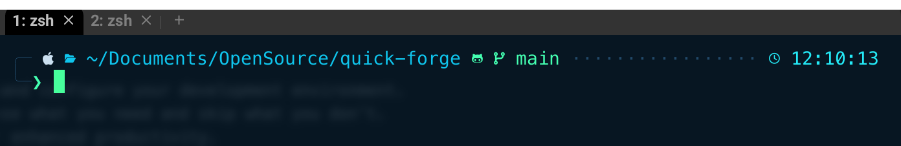

# Quick Forge

Quickly set up a new MacBook with everything you need to develop in the JavaScript/TypeScript ecosystem.

## Installation

### Option 1: One-line install (Recommended)
```bash
curl -fsSL https://raw.githubusercontent.com/tsotimus/quick-forge/main/install.sh | bash
```

### Option 2: Download binary manually
1. Go to the [releases page](https://github.com/tsotimus/quick-forge/releases)
2. Download the appropriate binary for your system
3. Make it executable: `chmod +x quickforge-darwin-arm64`
4. Move to your PATH: `sudo mv quickforge-darwin-arm64 /usr/local/bin/quickforge`

### Option 3: Build from source
```bash
git clone https://github.com/RockiRider/quick-forge.git
cd quickforge
make build
./quickforge
```

### Option 4: Go install (if you have Go installed)
```bash
go install github.com/RockiRider/quick-forge@latest
```

## Usage

```bash
# Interactive mode
quickforge

# Non-interactive mode (accepts all defaults)
quickforge -y

# Dry run (see what would be installed)
quickforge -d
```

## Key Features
- One script to install and configure your development environment.
- Modular installs: choose what you need and skip what you don't.
- Pre-configured zsh for enhanced productivity.



## What does the script do?

- Installs Homebrew, the macOS package manager.
- Installs Git and sets up an SSH key for GitHub.
- Installs Visual Studio Code (VSCode).
- Installs Node.js (via Volta), Deno, and Bun.
- Installs pnpm, the fast JavaScript package manager.
- Installs and configures WezTerm, a modern terminal emulator.
- Configures zsh with plugins for autosuggestions, syntax highlighting, and more.
- Lets you choose between installing Zen Browser or Arc Browser.


### ZSH Config and WezTerm config
Most of the config comes from these two videos:
[First Video](https://www.youtube.com/watch?v=mmqDYw9C30I)
[Second Video](https://www.youtube.com/watch?v=TTgQV21X0SQ)

### Git Alias's
```shell
alias g='git'                      # Shortcut to replace 'git' with 'g'
alias gs='git status'              # Check current branch status
alias ga='git add'                 # Stage specific files
alias gaa='git add --all'          # Stage all changes (tracked and untracked)
alias gc='git commit'              # Commit staged changes
alias gap='git add --patch'        # Interactive staging of changes (hunks)
alias gp='git push'                # Push commits to the remote
alias gl='git log'                 # Show commit history
alias gb='git branch'              # List or manage branches
alias gco='git checkout'           # Switch branches or restore files
alias gcon='git checkout -b'       # Checkout and create a new branch
alias gcm='git commit -m'          # Commit with a message inline
alias gundo='git reset --soft HEAD~1' # Undo the last commit (soft reset)
```

## Getting started

1. Either `git clone` or just download as a zip.
2. Run `chmod +x setup.sh`
3. Run `sh setup.sh`

### Go Migration Todo

- Fix Node install via Fnm
- Test via CI CD
- Install Bash script

#### Future Enhancements

Future Enhancements (optional section)

- Add support for other development ecosystems (Python, Go, etc.).
- Integration with Docker or Kubernetes for containerized setups.
- Optional database installation (PostgreSQL, MongoDB, etc)
